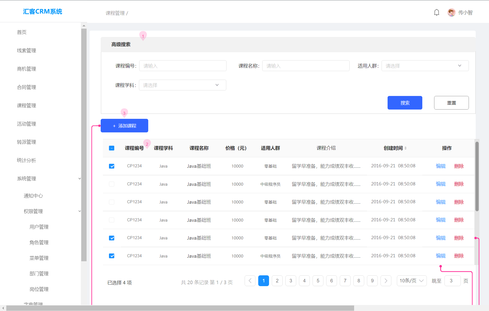
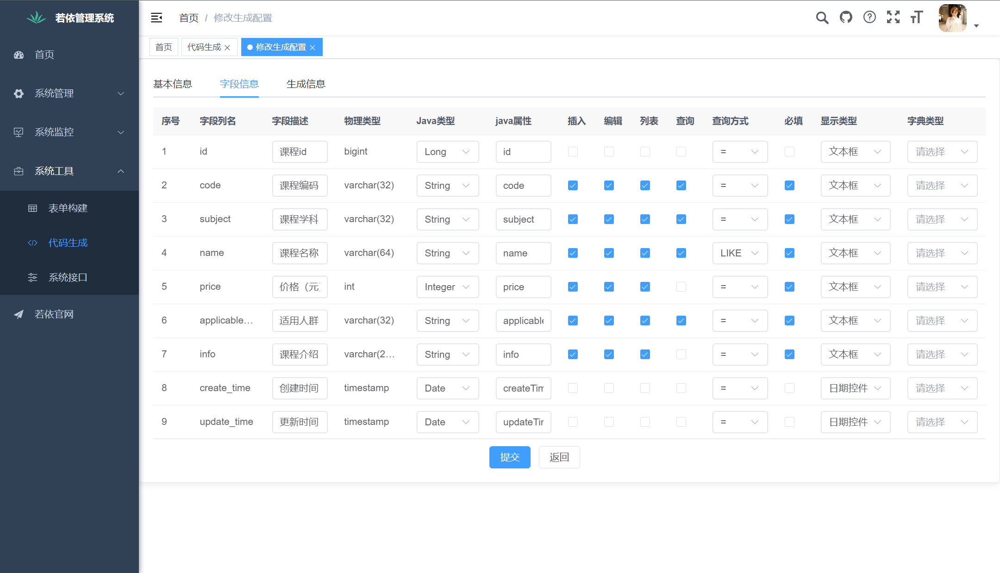
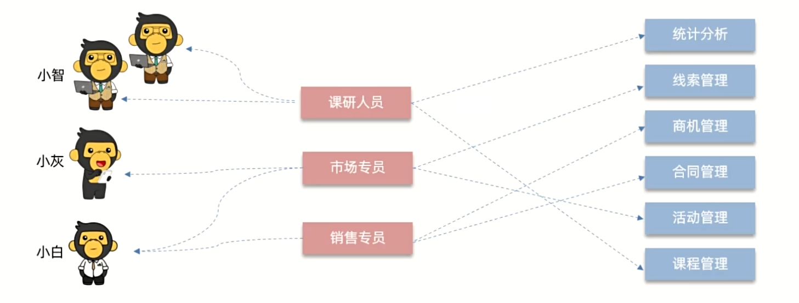
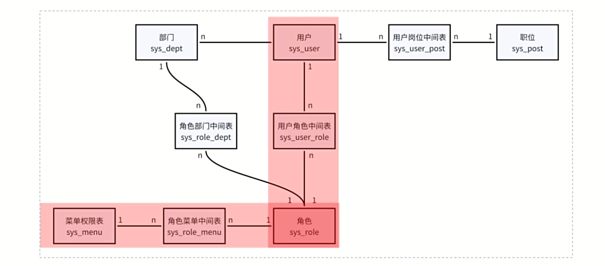
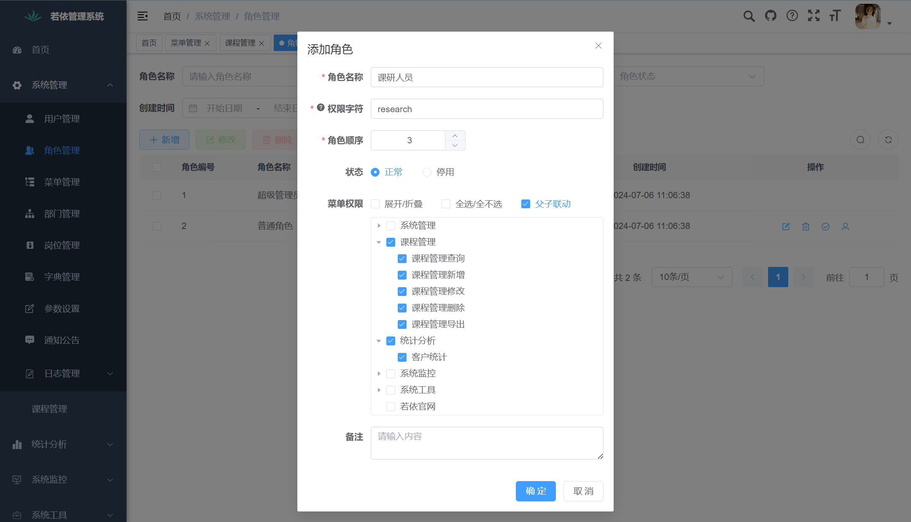
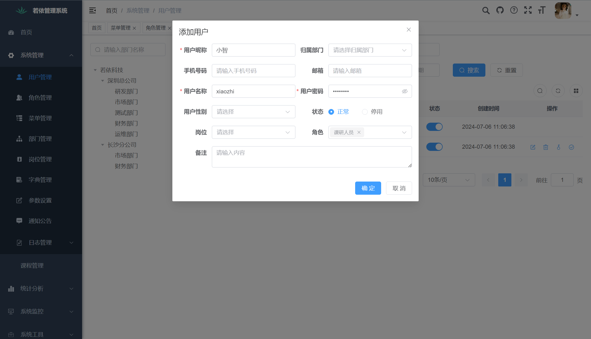
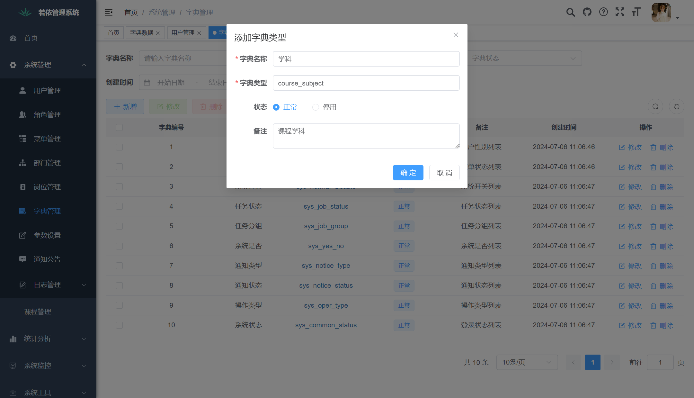
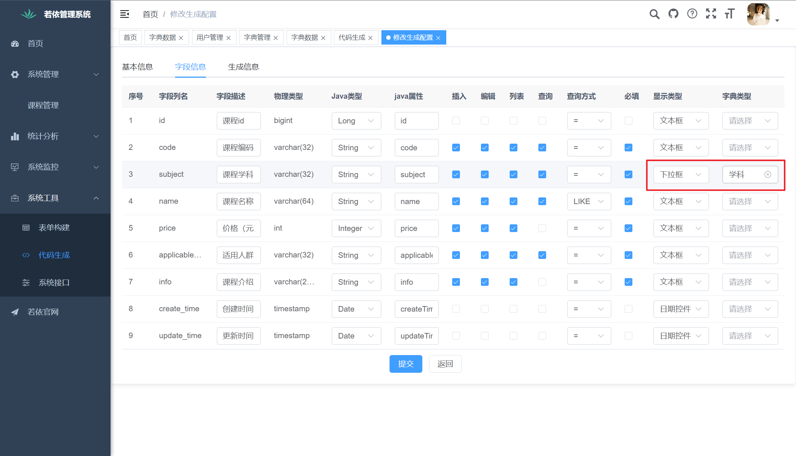

# ruoyi


# heima ruoyi

- Reference

  [ruoyi官网](https://ruoyi.vip/)、

  [RuoYi-Vue gitee](https://gitee.com/y_project/RuoYi-Vue), [RuoYi-Vue3 github](https://github.com/yangzongzhuan/RuoYi-Vue3), 

  


---

- 项目开发流程

  环境搭建 (技术选型 框架整合) - *ruoyi*

  原型设计 (数据库表 接口) - *ai* 

  编写代码 (前后端) - *ai*  *ruoyi*

  测试部署 - *ai*

- 策略

  *ai辅助编程* (通义灵码)

  *若伊框架*：快速构建、通用模块(系统登陆 权限控制 日志记录)、代码生成(定义表结构 重复代码)


---

- 若伊

  少量代码 快速搭建开发管理系统

- 若伊生态

  `RuoYi`：Bootstrap多模块版本  no!!!

  `RuoYi-Vue`：Vue前后端分离版本(*单体架构*)  ✔

  `RuoYi-Cloud`：SpringCloud*微服务*版本  

  `RuoYi-App`：UniApp移动端版本(无后端) 

  `RuoYi-other`：更多其他版本项目(`vue3+elementplus+vite`)

- RuoYi-Vue 

  项目定位：前后端分离 单体架构

  软件环境：jdk11, maven3.6, mysql8, redis5-win, nodejs16

  技术选型：springboot, springsecurity, mybatis, jwt, vue3, element-plus

  


---

- 课程前置

  springboot, mybatis

  vue3, axios, element-plus

  mysql, redis

  idea, vscode, git

- 课程总结

  todo

  


## 基础应用 (使用者)

### 若伊搭建

- 环境准备

  jdk11, maven3.6, 

  mysql8, redis5-win, nodejs16

  ```bash
  $ java -version
  java version "1.8.0_251"
  Java(TM) SE Runtime Environment (build 1.8.0_251-b08)
  Java HotSpot(TM) 64-Bit Server VM (build 25.251-b08, mixed mode)
  
  $ mvn -v
  
  $ mysql --version
  D:\systemEnvironment\MySQL8.0.21\MySQL Server 8.0\bin\mysql.exe  Ver 8.0.21 for Win64 on x86_64 (MySQL Community Server - GPL)
  
  $ node -v
  v18.19.1
  
  
  ```

- 初始化后端项目

  克隆项目、mysql导入配置、启动redis、启动类运行后端项目

  ```bash
  git clone https://gitee.com/y_project/RuoYi-Vue.git
  
  mysql -uroot -p123456
  create database ry_vue;
  
  # 导入数据库库表数据 (推荐使用idea工具)
  use ry_vue
  source D:\code2\java-code\ruoyi-learning\RuoYi-Vue\sql\quartz.sql
  source D:\code2\java-code\ruoyi-learning\RuoYi-Vue\sql\ry_20240629.sql
  
  ```

  RuoYi-Vue\ruoyi-admin\src\main\resources\application-druid.yml

  ```yml
              # 主库数据源
              master:
                  url: jdbc:mysql://localhost:3306/ry_vue?useUnicode=true&characterEncoding=utf8&zeroDateTimeBehavior=convertToNull&useSSL=true&serverTimezone=GMT%2B8
                  username: root
                  password: 123456
  
  ```

  redis

  ```bash
  cd D:\module\Redis-x64-5.0.14.1
  redis-server.exe redis.windows.conf
  
  ```

  RuoYi-Vue\ruoyi-admin\src\main\java\com\ruoyi\RuoYiApplication.java 启动类

- 初始化前端项目

  ```bash
  git clone https://github.com/yangzongzhuan/RuoYi-Vue3.git
  code ./RuoYi-Vue3
  
  cd RuoYi-Vue3
  npm install
  npm run dev
  
  ```

  


### 入门案例

- 需求

  课程管理 

  [页面原型](file:///E:/BaiduNetdiskDownload/2024-Java%E8%8B%A5%E4%BE%9D%E6%A1%86%E6%9E%B6%E4%B8%93%E9%A2%98%E8%AF%BE/01-%E5%9F%BA%E7%A1%80%E7%AF%87/%E8%B5%84%E6%96%99/02-%E5%85%A5%E9%97%A8%E6%A1%88%E4%BE%8B/%E5%AE%A2%E8%BE%BE%E5%A4%A9%E4%B8%8B%E9%A1%B5%E9%9D%A2%E5%8E%9F%E5%9E%8B/%E8%AF%BE%E7%A8%8B%E7%AE%A1%E7%90%86.html) [数据库表](file:///D:/code2/java-code/ruoyi-learning/RuoYi-Vue/sql/course_manage.sql) 代码生成器(整合代码)

  
  
- 步骤

  RuoYi-Vue\sql\course_manage.sql 

  

  ```
  ruoyi.zip
  # 动态菜单sql
  ruoyi.zip/courseMenu.sql
  # 前端代码
  ruoyi.zip/vue/api  前端请求js文件
  ruoyi.zip/vue/views  视图组件
  # 后端代码
  ruoyi.zip/main/java  三层架构 实体类
  ruoyi.zip/main/resources  mybatis映射文件
  
  # 整合代码
  
  ```

  


### 功能详解：权限控制

- 功能详解

- 系统管理 

  权限控制：用户管理、角色管理、菜单管理、部门管理、岗位管理

  数据字典

  其他功能：参数设置、通知公告、日志管理

- 系统监控

  在线用户、数据服务

  定时任务

- 系统工具

  表单构建、代码生成、系统接口

  


---

- 权限控制

- CRM系统

  https://huike-crm.itheima.net/#/login

  demo账号 (超级管理员)  查看所有功能菜单

  zhangsan账号 (市场专员)  查看线索菜单

  yueyue账号 (销售专员)  查看商机 合同等菜单 

  

  

  

  


---

- 若伊的权限管理

  用户管理 角色管理 菜单管理 

  RBAC 基于*角色*的访问控制 (员工表 角色表 菜单表 + 多对多的中间表)

  

  ```bash
  mysql> use ry_vue
  Database changed
  mysql> show tables;
  +--------------------------+
  | Tables_in_ry_vue         |
  +--------------------------+
  | gen_table                |
  | gen_table_column         |
  | qrtz_blob_triggers       |
  | qrtz_calendars           |
  | qrtz_cron_triggers       |
  | qrtz_fired_triggers      |
  | qrtz_job_details         |
  | qrtz_locks               |
  | qrtz_paused_trigger_grps |
  | qrtz_scheduler_state     |
  | qrtz_simple_triggers     |
  | qrtz_simprop_triggers    |
  | qrtz_triggers            |
  | sys_config               |
  | sys_dept                 |部门表
  | sys_dict_data            |
  | sys_dict_type            |
  | sys_job                  |
  | sys_job_log              |
  | sys_logininfor           |
  | sys_menu                 |					菜单权限表
  | sys_notice               |
  | sys_oper_log             |
  | sys_post                 |职位信息表
  | sys_role                 |					菜单角色表
  | sys_role_dept            |	用户和部门关联
  | sys_role_menu            |						用户和菜单关联
  | sys_user                 |					用户信息表
  | sys_user_post            |	用户和岗位关联
  | sys_user_role            |						用户和角色关联
  | tb_course                |
  +--------------------------+
  31 rows in set (0.01 sec)
  
  ```

  

  


---

- 案例

  用户小智 ~ 科研人员角色 ~ 课程管理 统计分析菜单

- 步骤

  创建菜单：课程管理 统计分析

  创建角色：科研人员 (分配权限)

  创建用户：小智 (关联角色)

  

  

  

  


### 功能详解：数据字典

- 背景介绍

  背景：维护系统中常见的*静态数据* (性别 状态 - 不经常变的数据)

  好处：复用性 方便修改易于维护

  管理：字典类型、字典数据

  ```bash
  mysql> use ry_vue
  Database changed
  mysql> show tables;
  +--------------------------+
  | Tables_in_ry_vue         |
  +--------------------------+
  | gen_table                |
  | gen_table_column         |
  | qrtz_blob_triggers       |
  | qrtz_calendars           |
  | qrtz_cron_triggers       |
  | qrtz_fired_triggers      |
  | qrtz_job_details         |
  | qrtz_locks               |
  | qrtz_paused_trigger_grps |
  | qrtz_scheduler_state     |
  | qrtz_simple_triggers     |
  | qrtz_simprop_triggers    |
  | qrtz_triggers            |
  | sys_config               |
  | sys_dept                 |
  | sys_dict_data            |字典数据表
  | sys_dict_type            |字典类型表
  | sys_job                  |
  | sys_job_log              |
  | sys_logininfor           |
  | sys_menu                 |					
  | sys_notice               |
  | sys_oper_log             |
  | sys_post                 |
  | sys_role                 |					
  | sys_role_dept            |	
  | sys_role_menu            |						
  | sys_user                 |					
  | sys_user_post            |	
  | sys_user_role            |						
  | tb_course                |
  +--------------------------+
  31 rows in set (0.01 sec)
  
  
  mysql> desc sys_dict_type;
  +-------------+--------------+------+-----+---------+----------------+
  | Field       | Type         | Null | Key | Default | Extra          |
  +-------------+--------------+------+-----+---------+----------------+
  | dict_id     | bigint       | NO   | PRI | NULL    | auto_increment |
  | dict_name   | varchar(100) | YES  |     |         |                |
  | dict_type   | varchar(100) | YES  | UNI |         |                |主外键关联 (一)
  | status      | char(1)      | YES  |     | 0       |                |
  | create_by   | varchar(64)  | YES  |     |         |                |
  | create_time | datetime     | YES  |     | NULL    |                |
  | update_by   | varchar(64)  | YES  |     |         |                |
  | update_time | datetime     | YES  |     | NULL    |                |
  | remark      | varchar(500) | YES  |     | NULL    |                |
  +-------------+--------------+------+-----+---------+----------------+
  9 rows in set (0.00 sec)
  
  mysql> desc sys_dict_data;
  +-------------+--------------+------+-----+---------+----------------+
  | Field       | Type         | Null | Key | Default | Extra          |
  +-------------+--------------+------+-----+---------+----------------+
  | dict_code   | bigint       | NO   | PRI | NULL    | auto_increment |
  | dict_sort   | int          | YES  |     | 0       |                |
  | dict_label  | varchar(100) | YES  |     |         |                |
  | dict_value  | varchar(100) | YES  |     |         |                |
  | dict_type   | varchar(100) | YES  |     |         |                |主外键关联 (多)
  | css_class   | varchar(100) | YES  |     | NULL    |                |
  | list_class  | varchar(100) | YES  |     | NULL    |                |
  | is_default  | char(1)      | YES  |     | N       |                |
  | status      | char(1)      | YES  |     | 0       |                |
  | create_by   | varchar(64)  | YES  |     |         |                |
  | create_time | datetime     | YES  |     | NULL    |                |
  | update_by   | varchar(64)  | YES  |     |         |                |
  | update_time | datetime     | YES  |     | NULL    |                |
  | remark      | varchar(500) | YES  |     | NULL    |                |
  +-------------+--------------+------+-----+---------+----------------+
  14 rows in set (0.60 sec)
  
  
  mysql> select * from sys_dict_type;
  +---------+-----------+--------------------+--------+-----------+---------------------+-----------+-------------+--------------+
  | dict_id | dict_name | dict_type          | status | create_by | create_time         | update_by | update_time | remark       |
  +---------+-----------+--------------------+--------+-----------+---------------------+-----------+-------------+--------------+
  |       1 | 用户性别  | sys_user_sex       | 0      | admin     | 2024-07-06 11:06:46 |           | NULL        | 用户性别列表 |
  |       2 | 菜单状态  | sys_show_hide      | 0      | admin     | 2024-07-06 11:06:46 |           | NULL        | 菜单状态列表 |
  +---------+-----------+--------------------+--------+-----------+---------------------+-----------+-------------+--------------+
  10 rows in set (0.00 sec)
  
  mysql> select * from sys_dict_data;
  +-----------+-----------+------------+------------+--------------------+-----------+------------+------------+--------+-----------+---------------------+-----------+---------------------+------------+
  | dict_code | dict_sort | dict_label | dict_value | dict_type          | css_class | list_class | is_default | status | create_by | create_time         | update_by | update_time         | remark     |
  +-----------+-----------+------------+------------+--------------------+-----------+------------+------------+--------+-----------+---------------------+-----------+---------------------+------------+
  |         1 |         1 | 男性       | 0          | sys_user_sex       |           |            | Y          | 0      | admin     | 2024-07-06 11:06:47 | admin     | 2024-07-06 17:09:28 | 性别男     |
  |         2 |         2 | 女性       | 1          | sys_user_sex       |           |            | N          | 0      | admin     | 2024-07-06 11:06:47 | admin     | 2024-07-06 17:09:33 | 性别女     |
  |         3 |         3 | 未知       | 2          | sys_user_sex       |           |            | N          | 0      | admin     | 2024-07-06 11:06:47 |           | NULL                | 性别未知   |
  |         4 |         1 | 显示       | 0          | sys_show_hide      |           | primary    | Y          | 0      | admin     | 2024-07-06 11:06:47 |           | NULL                | 显示菜单   |
  |         5 |         2 | 隐藏       | 1          | sys_show_hide      |           | danger     | N          | 0      | admin     | 2024-07-06 11:06:47 |           | NULL                | 隐藏菜单   |
  +-----------+-----------+------------+------------+--------------------+-----------+------------+------------+--------+-----------+---------------------+-----------+---------------------+------------+
  
  ```

  


---

- 案例

  课程管理的学科字段 数据字典

- 步骤

  定义字典类型 字典数据

  修改代码生成信息 (下拉框)

  下载代码 导入前端

  

  
  
  ```bash
  # 将生成的代码的前端组件 整合到项目中 (vue/views) ✔
  ```
  
  


### 功能详解：其他功能

- 参数设置
- 通知公告
- 日志管理


### 项目结构

快速定位功能模块 修改配置文件


### 源码阅读


### 二次开发

新业务模块的创建

多表业务逻辑的代码生成

用户界面的定制


### ai辅助编程


## 项目实战：帝可得

- 帝可得

  后端管理系统

  


### 项目搭建


### 前端页面


### 点位管理


### 人员管理


### 设备管理


### ai优化代码


### ai生成代码


### ai代码调错


## 拔高原理 (开发者)

### velocity代码生成器


### rbac权限控制


### 异步任务管理器


### 自定义日志注解


### ai生成注释


### ai辅助阅读


# heima echarts


# vue datax

http://datav.jiaminghi.com/guide/


# train system

- 校园实训平台


- 管理员
- 用户管理
- 系统管理
- 集群管理


- 教师端
- 


- 学生端

- 

  


